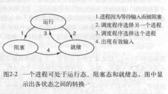

#第2章 进程与线程 

进程是对正在运行程序的一个抽象。 

##2.1进程

CPU在各进程间来回快速切换，这种切换是多道程序设计。 

###2.1.1.1进程模型 

CPU使用调度算法决定何时停止一个进程，转而为另一个进程提供服务。一个程序运行了两遍，算作两个进程，操作系统使它们共享一套代码。 

###2.1.2 进程的创建

四种主要事件可以创建进程 

- 系统初始化 

- 正在运行的程序执行创建进程的系统调用

- 用户请求创建一个新进程

- 一个批处理作业的初始化

​    在Uninx只有一个fork一个系统调用创建新进程(与调用进程相同的副本)，然后有相同的内存映像，同样的资源。子进程接着执行execve或其他类似系统调用，修改其内存映像并运行一个新的程序。所以，shell键入命令sort之后shell是创建子进程，然后子进程执行sort用于处理输入与输出。分为两步。

​    而windows中正好相反，一个Win32函数调用CreateProcess既处理进程的创建，也负责把正确的程序装入新进程，传递所有相关参数。

​    Uninx的子进程的地址空间是父进程地址空间的副本，而windows系统父进程子进程的地址空间一开始就是不同的。在Uninx中，子进程可以通过写时复制共享父进程的所有内存，可写的内存是不可以共享的。

###2.1.3 进程的终止

- 正常退出(自愿的) 

- 出错退出(自愿的) 

- 严重错误(非自愿) 

- 被其他进程杀死(非自愿) 

​    在Uninx终止进程的系统调用是kill，Win32中的函数是TerminateProcess，杀死进程都必须获得确定的授权。有些系统杀死父进程会杀死所有其创建的子进程，不过Uninx和Windows都不是这种工作方式。

###2.1.4 进程的层次结构

​    在Uninx中，进程和它所有的子进程及后裔组成一个进程组，父进程与子进程以某种形式保持关联，一个进程最多只有一个父进程，可以有多个子进程。Uninx启动初始化时执行init的特殊进程，以后所有的进程都属于以init为根的一棵树。

​    在Windows中没有进程层次的概念，所有进程地位相同。因为父进程拥有一个特别的令牌(句柄)可以用来控制子进程，而父进程有权把句柄传送给其他进程。但是，在Uninx中，子进程的“继承权”不能被其他进程剥夺。

###2.1.5 进程的状态

​	尽管进程有自己的程序计数器和内部状态，但是进程之间常常需要相互作用。从而有不同的状态。

- 运行态 （该时刻进程实际占用CPU）
- 就绪态 （进程可运行，但CPU被其他进程所占用，而暂时停止)
- 阻塞态  (除非某种外部事件发生，否则进程不能运行)

三种状态之间有四种可能的转换关系。    

1. 进程因为等待输入而被阻塞
2. 调度程序选择运行另一个程序
3. 调度程序选择这个进程
4. 出现有效输入

> 进程模型：基于进程的操作系统最底层的是中断和调度处理（调度程序），在该层之上是顺序进程。

调度程序是一段非常小的程序，操作系统的其他部分被简单地组织成进程的形式。不过少有真实的系统是以这一理想方式构造。

###2.1.6 进程的实现

